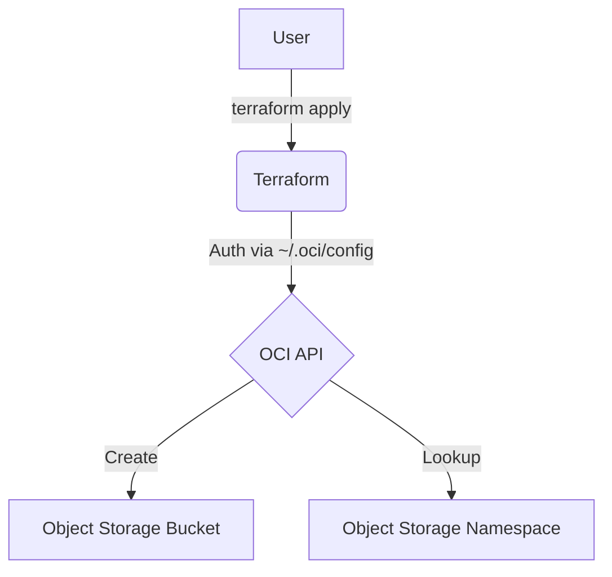
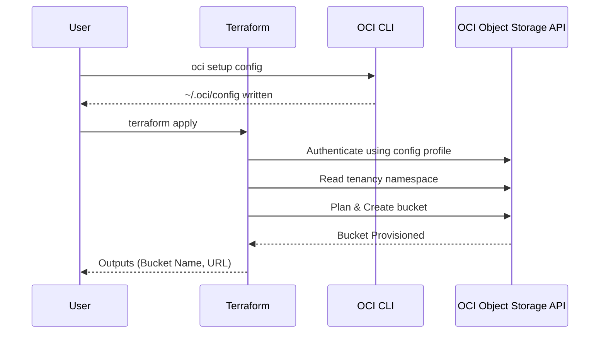

# terraform-oci-object-storage

This Terraform project provisions an Oracle Cloud Infrastructure (OCI) Object Storage bucket.

## Architecture

### Flowchart



### Sequence Diagram



## Bucket Specifications

- **Storage Tier**: `Standard` (covered by the Always Free allowance). This property is immutable after creation.
- **Access Type**: `NoPublicAccess` — the bucket is private and reachable only by authenticated callers.
- **Namespace**: Looked up with the `oci_objectstorage_namespace` data source rather than passed in, so there is no namespace string to copy from the console.
- **Naming**: A random 8-character hex suffix is automatically appended to your `bucket_name` to keep the name unique within the namespace (e.g., `my-bucket-a1b2c3d4`).
- **Provisioning Only**: This project creates the bucket resource only; no files or objects are uploaded.

## OCI Always Free Limits

To stay within the free tier, ensure your usage does not exceed:

- **Storage**: 20 GB total across the Standard, Infrequent Access and Archive tiers.
- **API Requests**: 50,000 Object Storage API requests per month.
- **Data Transfer**: 10 TB of outbound data transfer per month.

> Always Free resources should be created in your tenancy's **home region**. Creating the bucket elsewhere can consume paid capacity.

## Prerequisites

1.  **OCI CLI**: [Installed](https://docs.oracle.com/en-us/iaas/Content/API/SDKDocs/cliinstall.htm) and configured.
2.  **Terraform**: `>= 1.6.4` — [installed](https://developer.hashicorp.com/terraform/downloads). The version floor comes from `skip_s3_checksum`, used by the remote state backend.

## Setup & Deployment

1.  **Authenticate**:
    Instead of committing credentials, this project reads them from your local OCI config file — the same way the GCP project uses your local `gcloud` credentials.

    ```bash
    # Writes ~/.oci/config and generates an API signing key
    oci setup config
    ```

    When prompted, paste your tenancy OCID, your user OCID, and your home region. Then upload the generated public key: Console → My profile → API keys → Add API key → Paste public key.

2.  **Configure Variables**:
    Create a `terraform.tfvars` file based on the example:

    ```hcl
    compartment_id = "ocid1.compartment.oc1..aaaa..."
    oci_region     = "us-ashburn-1"
    bucket_name    = "my-unique-bucket-name"
    ```

3.  **Deploy**:

    ```bash
    # Initialize (downloads the oci and random providers).
    # -backend=false keeps state local. To use the Object Storage remote
    # backend instead, see "Remote State (Object Storage)" below.
    terraform init -backend=false

    # Apply changes
    terraform apply
    ```

4.  **Outputs**:
    After a successful deployment, Terraform will output the bucket name, namespace, URL and OCID.

## Variables

| Variable             | Description                                     | Type     | Default          |
| -------------------- | ----------------------------------------------- | -------- | ---------------- |
| `compartment_id`     | OCID of the compartment to create the bucket in | `string` | (required)       |
| `region`             | OCI region (e.g. `us-ashburn-1`)                | `string` | `"us-ashburn-1"` |
| `bucket_name`        | Base bucket name (random suffix appended)       | `string` | (required)       |
| `oci_config_profile` | Profile name in `~/.oci/config`                 | `string` | `"DEFAULT"`      |

## Outputs

| Output             | Description                                  |
| ------------------ | -------------------------------------------- |
| `bucket_name`      | Name of the created bucket                   |
| `bucket_namespace` | Object Storage namespace the bucket lives in |
| `bucket_url`       | Base URL of the bucket                       |
| `bucket_id`        | OCID of the created bucket                   |

## Resources Created

- `data.oci_objectstorage_namespace.this` – Resolves the tenancy's Object Storage namespace
- `random_id.bucket_suffix` – Random suffix for a unique bucket name
- `oci_objectstorage_bucket.bucket` – Object Storage bucket

## CI/CD Setup (GitHub Actions)

### Prerequisites

1. **Create an Object Storage bucket** for Terraform remote state, plus a **Customer Secret Key** (Console → My profile → Customer secret keys) so the S3-compatible API can reach it. See [Remote State](#remote-state-object-storage) below.

2. **Generate an API signing key** in the OCI Console (My profile → API keys → Add API key → Generate API key pair). Download the private key — you will not be able to retrieve it again.

3. **Add GitHub secrets**:

   | Secret Name         | Value                                                           |
   | ------------------- | --------------------------------------------------------------- |
   | `OCI_TENANCY_OCID`  | Your tenancy OCID                                               |
   | `OCI_USER_OCID`     | Your user OCID                                                  |
   | `OCI_FINGERPRINT`   | Key fingerprint shown after adding the API key                  |
   | `OCI_PRIVATE_KEY`   | Full contents of the downloaded private key file                |
   | `OCI_NAMESPACE`     | Object Storage namespace (`oci os ns get`)                      |
   | `OCI_S3_ACCESS_KEY` | Customer Secret Key access key                                  |
   | `OCI_S3_SECRET_KEY` | Customer Secret Key secret                                      |
   | `TF_BUCKET_NAME`    | Your state bucket name                                          |
   | `TF_BUCKET_PREFIX`  | State path prefix (e.g., `terraform-oraclecloud-objectstorage`) |

4. **Run the workflow**:
   - **Apply**: Go to Actions → **CD - OCI Object Storage (Apply)** → fill in all inputs
   - **Destroy**: Go to Actions → **CD - OCI Object Storage (Destroy)** → fill in all inputs

> The workflows write `~/.oci/config` and a `backend.tfvars` from these secrets at runtime. Nothing is committed.

## Remote State (Object Storage)

OCI has no native Terraform backend, so state is stored in an Object Storage bucket through its **S3-compatible API**. The compatibility flags live in `providers.tf`; only the environment-specific values come from `backend.tfvars`:

```hcl
terraform {
  backend "s3" {
    bucket = "your-terraform-state-bucket"
    key    = "terraform-oraclecloud-objectstorage/terraform.tfstate"
    region = "us-ashburn-1"

    endpoints = {
      s3 = "https://<namespace>.compat.objectstorage.us-ashburn-1.oraclecloud.com"
    }
  }
}
```

Create a `backend.tfvars` file based on `backend.tfvars.example` and initialize:

```bash
terraform init -backend-config="backend.tfvars"
```

Two things to note:

- **Authentication is not the same key.** The S3-compatible API uses a **Customer Secret Key**, not your API signing key. Provide it through the standard AWS variables so it stays out of the config file:
  ```bash
  export AWS_ACCESS_KEY_ID="<customer-secret-key-id>"
  export AWS_SECRET_ACCESS_KEY="<customer-secret-key>"
  ```
- **Local state still works.** Skip all of the above and run `terraform init -backend=false` if you do not need remote state. A bare `terraform init` will not work, because the `s3` backend needs the values from `backend.tfvars`.
